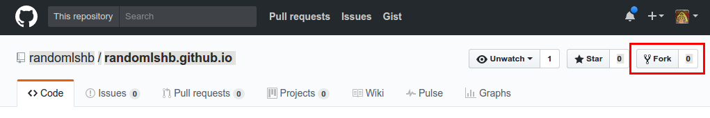

# Harmony Brigade Randomizer

## Create a Github account for your brigade

```
NOTE: Your username will be your URL (unless you redirect using DNS)
```

## Clone repositiory

Once logged into your account, go to the original [randomlshb](https://github.com/randomlshb/randomlshb.github.io) repository and Click "Fork"


