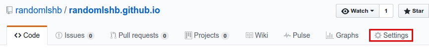
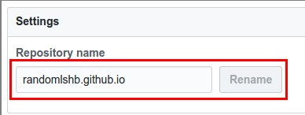

# Harmony Brigade Randomizer

## Create a Github account for your brigade

```
NOTE: Your username will be your URL (unless you redirect using DNS)
```

## Clone repositiory

Once logged into your account, go to the original [randomlshb](https://github.com/randomlshb/randomlshb.github.io) repository and Click "Fork"


## Edit your own repository

"Forking" the repository gives you a carbon copy of the website.

Head over to your repository at:

```
https://github.com/YOURUSERNAME/randomlshb.github.io
```

Click on `Settings`:



Rename your repository to `YOUR ACCOUNT USERNAME` and then click `Rename`:


